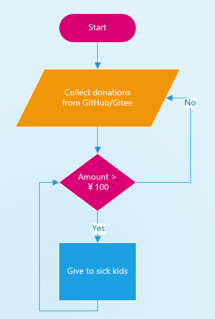

## Sponsorship
- Thanks for your generosity 🙏
- All donations will be used to help sick kids ❤️

| Channel | Paypal | Gitee | Wechat |
| --- | --- | --- | --- | --- |
| Link/QR |  |  |  |

## Charity - Help kids
[中文](#救助大病儿童)
- We give to sick kids
- Each give was replied with "Donated from GuiLite Dev" for easy searching

### How to work

### Track list
| Date Given | Amount | Recipient Organization | Kid's name | Reason |
| --- | --- | --- | --- | --- |
| 2019-6-24 | ￥20 | China Charities Aid Foundation for Children | Yan Wang | [Blood cancer](https://yglian.qschou.com/gongyi/publicSite/detail?ChannelId=zhech&id=201905230000000050026157&mp=toutiao20190624) |
| 2019-6-25 | ￥20 | China Charities Aid Foundation for Children | Yixuan Wu | [Blood cancer](https://www.toutiao.com/a6706325979037434375/?timestamp=1561466239&app=news_article&group_id=6706325979037434375&req_id=201906252037190100180692204641D7D) |
| 2019-6-25 | ￥20 | China Charities Aid Foundation for Children | Chenchen | [Neuroblastoma](https://m.toutiaocdn.com/group/6706384216721998339/?app=news_article&timestamp=1561466189&req_id=2019062520362901001703913820265FD&group_id=6706384216721998339) |
| 2019-6-28 | ￥20 | China Charities Aid Foundation for Children | Xinliang Wang | [Fire burn](https://m.toutiaocdn.com/item/6707482644117979661/?app=news_article&timestamp=1561734886&req_id=201906282314460100160191554395E50&group_id=6707482644117979661) |
| 2019-6-28 | ￥20 | China Charities Aid Foundation for Children | Zihan Lin | [Acute lymphoblastic leukemia](https://m.toutiaocdn.com/item/6707041382608929291/?app=news_article&timestamp=1561734915&req_id=201906282315150101520440935242685&group_id=6707041382608929291) |
| 2019-6-28 | ￥20 | China Charities Aid Foundation for Children | Ziyang Li | [Pancreatoblastoma](https://m.toutiaocdn.com/item/6706008540542140940/?app=news_article&timestamp=1561734932&req_id=2019062823153101001703913896979C2&group_id=6706008540542140940) |

## 救助大病儿童
- 我们救助“大病”儿童
- 每条救助下面都有回复：“GuiLite开发者捐助”,以便查询

### 救助流程

### 救助记录
| 救助日期 | 金额 | 收款机构 | 受助者姓名 | 受助原因 |
| --- | --- | --- | --- | --- |
| 2019-6-24 | ￥20 | 中华少年儿童慈善救助基金会 | 王研 | [血癌](https://yglian.qschou.com/gongyi/publicSite/detail?ChannelId=zhech&id=201905230000000050026157&mp=toutiao20190624) |
| 2019-6-25 | ￥20 | 中华少年儿童慈善救助基金会 | 吴奕轩 | [血癌](https://www.toutiao.com/a6706325979037434375/?timestamp=1561466239&app=news_article&group_id=6706325979037434375&req_id=201906252037190100180692204641D7D) |
| 2019-6-25 | ￥20 | 中华少年儿童慈善救助基金会 | 晨晨 | [神经母细胞瘤](https://m.toutiaocdn.com/group/6706384216721998339/?app=news_article&timestamp=1561466189&req_id=2019062520362901001703913820265FD&group_id=6706384216721998339) |
| 2019-6-28 | ￥20 | 中华少年儿童慈善救助基金会 | 王兴亮 | [烧伤](https://m.toutiaocdn.com/item/6707482644117979661/?app=news_article&timestamp=1561734886&req_id=201906282314460100160191554395E50&group_id=6707482644117979661) |
| 2019-6-28 | ￥20 | 中华少年儿童慈善救助基金会 | 林子涵 | [急性淋巴细胞白血病](https://m.toutiaocdn.com/item/6707041382608929291/?app=news_article&timestamp=1561734915&req_id=201906282315150101520440935242685&group_id=6707041382608929291) |
| 2019-6-28 | ￥20 | 中华少年儿童慈善救助基金会 | 李子洋| [胰母细胞瘤](https://m.toutiaocdn.com/item/6706008540542140940/?app=news_article&timestamp=1561734932&req_id=2019062823153101001703913896979C2&group_id=6706008540542140940) |
